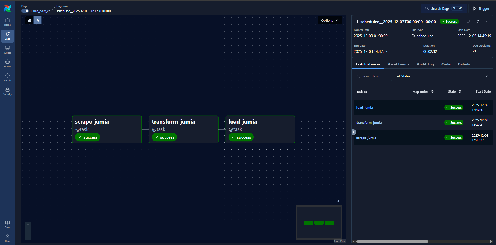
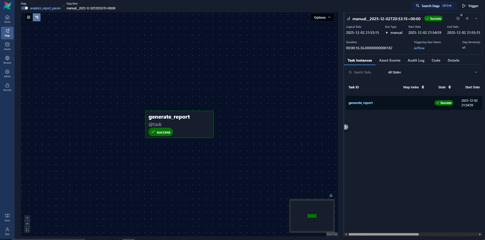
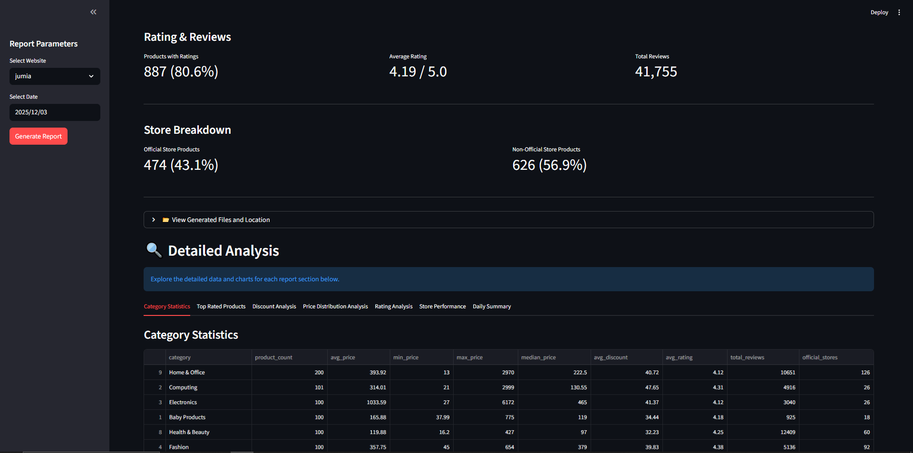
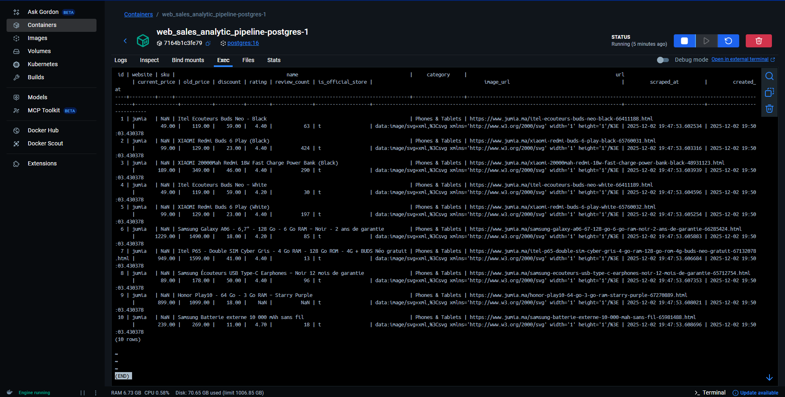

# 🛒 Web Sales Analytics Pipeline

[](https://github.com/ibrahimGoumrane/web_sales_analytic_pipeline/actions/workflows/tests.yml)
[](https://www.python.org/downloads/)
[](https://www.docker.com/)
[](https://airflow.apache.org/)

> **Production-grade data engineering project** featuring automated ETL pipelines, real-time analytics, and interactive dashboards for e-commerce price monitoring.

## 📊 Overview

An end-to-end data engineering solution that **automatically scrapes, processes, and analyzes** product data from Jumia.ma (Morocco's largest e-commerce platform). The system generates comprehensive analytics reports with **visualizations** and provides an **interactive Streamlit dashboard** for real-time insights.

**Built with modern data engineering best practices:** containerization, orchestration, automated testing, and CI/CD.

## ✨ Key Features

### 🔍 **Automated Web Scraping**

- Multi-category product extraction from Jumia.ma
- Intelligent pagination and rate limiting
- 1000+ products scraped daily across electronics, fashion, home goods
- Robust error handling and retry logic

### 🔄 **Smart Data Processing**

- Advanced price normalization (handles multiple currency formats)
- Multi-locale numeric parsing (commas, spaces, mixed formats)
- Data quality validation and cleansing
- Idempotent transformations for reliable re-runs

### 💾 **PostgreSQL Data Warehouse**

- Automated schema creation and migration
- Optimized indexing on SKU and website columns
- UPSERT logic for conflict resolution
- Separate databases: `airflow` (metadata) + `sales_analytics` (data)

### ⚙️ **Apache Airflow Orchestration**

- **Daily ETL DAG:** Automated scraping, transformation, and loading
- **Analytics DAG:** On-demand report generation with 7 CSV outputs + 6 visualizations
- Task dependencies and failure notifications
- Parameterized execution with date selection

### 📊 **Interactive Dashboard**

- Real-time Streamlit dashboard with live database connection
- Category breakdown, price trends, and top products
- Export capabilities and date range filtering
- Professional metrics and visualizations

### 🧪 **Comprehensive Testing & CI/CD**

- Automated unit tests for all pipeline components
- GitHub Actions workflow with Docker Compose integration
- Code coverage reporting
- Tests run on every push/PR

## 🛠️ Tech Stack

| Component            | Technology                  |
| -------------------- | --------------------------- |
| **Orchestration**    | Apache Airflow 3.1.3        |
| **Web Scraping**     | BeautifulSoup4, Requests    |
| **Database**         | PostgreSQL 16               |
| **Data Processing**  | Pandas, NumPy               |
| **Visualization**    | Matplotlib, Seaborn, Plotly |
| **Dashboard**        | Streamlit                   |
| **Containerization** | Docker & Docker Compose     |
| **CI/CD**            | GitHub Actions, pytest      |
| **Python**           | 3.12                        |

## 📁 Project Structure

```text
web_sales_analytic_pipeline/
│
├── airflow/
│   └── dags/
│       └── sales_etl_dag.py          # Main DAG definition (scrape, transform, load)
│
├── scraping/
│   ├── base.py                       # Abstract base scraper class
│   ├── main.py                       # Scraper orchestrator
│   ├── utils.py                      # URL handling utilities
│   └── jumia/
│       └── main.py                   # Jumia scraper implementation
│
├── transform/
│   ├── base.py                       # Abstract base transformer
│   ├── main.py                       # Transform orchestrator
│   └── jumia/
│       └── main.py                   # Jumia data cleaner
│
├── load/
│   └── load_postgres.py              # PostgreSQL loader with analytics queries
│
├── reports/
│   ├── base.py                       # Analytics report generator
│   ├── helpers.py                    # Plotting utility functions
│   ├── main.py                       # Report orchestrator
│   └── __init__.py                   # Lazy import wrapper
│
├── dashboard/
│   └── main.py                       # Streamlit dashboard app
│
├── tests/
│   ├── test_scraper.py               # Scraper unit tests
│   ├── test_transformer.py           # Data cleaning tests
│   ├── test_loader.py                # Database loader tests
│   └── test_reports.py               # Report generation tests
│
├── .github/
│   └── workflows/
│       └── tests.yml                 # CI/CD pipeline configuration
│
├── data/
│   ├── raw/jumia/                    # Raw scraped data (JSON/CSV)
│   ├── processed/jumia/              # Cleaned data (CSV)
│   └── reports/report_YYYYMMDD/      # Generated analytics reports
│       ├── *.csv                     # Category stats, top products, discounts, etc.
│       ├── *.png                     # Visualizations and charts
│       └── REPORT_SUMMARY.txt        # Executive summary
│
├── docs/
│   ├── screenshots/                  # UI screenshots for documentation
│   └── samples/                      # Sample data outputs
│
├── Dockerfile                        # Custom Airflow image with plotting libs
├── streamlit.Dockerfile              # Streamlit dashboard image
├── pytest.Dockerfile                 # Test runner image
├── docker-compose.yaml               # Multi-container orchestration
├── Makefile                          # Build automation commands
├── requirements.txt                  # Python dependencies
├── .env                              # Environment variables
├── StartupDocs.md                    # Quick start guide
├── Recomendations.md                 # Enhancement roadmap
└── README.md                         # This file
```

## 🚀 Getting Started

### Prerequisites

- **Docker Desktop** 20.10+
- **Python** 3.12+
- **Make** (optional, for convenience commands)
- **Git**

### Quick Start

1. **Clone the repository**

   ```bash
   git clone https://github.com/ibrahimGoumrane/web_sales_analytic_pipeline.git
   cd web_sales_analytic_pipeline
   ```

2. **Ensure Docker Desktop is running**

   ```bash
   docker --version
   docker ps
   ```

3. **Start the entire pipeline**

   ```bash
   make all
   ```

   This will:

   - Start PostgreSQL database
   - Initialize Airflow (creates admin user)
   - Start Airflow webserver and scheduler
   - Launch Streamlit dashboard
   - Wait ~2-3 minutes for initialization

4. **Access the dashboards**

   **Airflow UI:**

   - URL: <http://localhost:8085>
   - Username: `admin`
   - Password: `admin`

   **Streamlit Dashboard:**

   - URL: <http://localhost:8501>
   - Interactive analytics and visualizations

5. **Run the pipeline**
   - Find `jumia_daily_etl` DAG in the Airflow UI
   - Toggle switch to enable
   - Click ▶️ Play → Trigger DAG
   - Monitor execution (Green = Success)

### Verify Installation

```bash
# Check services are running
make ps

# View logs
make logs

# Check database
docker exec -it web_sales_analytic_pipeline-postgres-1 psql -U airflow -d sales_analytics
# Inside psql:
SELECT COUNT(*) FROM products WHERE website = 'jumia';
\q
```

### Available Commands

```bash
make help          # Show all available commands
make up            # Start all services
make down          # Stop all services
make restart       # Restart services
make logs          # View all logs
make clean         # Remove all data and reset
make ps            # Check container status
make test          # Run unit tests locally
```

For detailed setup instructions, see [StartupDocs.md](StartupDocs.md).

## 📊 Data Output

### Database Schema

**Database:** `sales_analytics`  
**Table:** `products`

| Column            | Type          | Description            |
| ----------------- | ------------- | ---------------------- |
| id                | SERIAL        | Primary key            |
| website           | VARCHAR(50)   | Source website (jumia) |
| sku               | VARCHAR(100)  | Product SKU            |
| name              | TEXT          | Product name           |
| url               | TEXT          | Product URL            |
| current_price     | NUMERIC(10,2) | Current price          |
| old_price         | NUMERIC(10,2) | Original price         |
| discount          | NUMERIC(5,2)  | Discount percentage    |
| rating            | NUMERIC(3,2)  | Product rating (0-5)   |
| review_count      | INTEGER       | Number of reviews      |
| is_official_store | BOOLEAN       | Official store badge   |
| image_url         | TEXT          | Product image URL      |
| scraped_at        | TIMESTAMP     | Scraping timestamp     |
| created_at        | TIMESTAMP     | Record creation time   |

### File Outputs

- **`data/raw/jumia/`** — Raw scraped data (JSON/CSV)
- **`data/processed/jumia/`** — Cleaned product data (CSV)
- **`data/reports/report_YYYYMMDD/`** — Analytics reports and visualizations:
  - `category_statistics.csv` — Product counts, prices, ratings by category
  - `top_rated_products.csv` — Top 50 products by weighted score
  - `biggest_discounts.csv` — Top 100 products by discount percentage
  - `price_statistics.csv` — Price distribution metrics
  - `rating_statistics.csv` — Rating and review analysis
  - `store_performance.csv` — Official vs non-official store comparison
  - `daily_summary.csv` — Daily aggregated statistics
  - `*.png` — 6 visualization charts
  - `REPORT_SUMMARY.txt` — Executive summary
- **`logs/`** — Application logs

## ⚙️ Pipeline Execution

### Daily ETL DAG (`jumia_daily_etl`)

Runs daily at midnight with the following workflow:

1. **Scrape Jumia** (Task: `scrape_jumia`)

   - Discovers categories automatically
   - Scrapes 100 products per category
   - Saves raw data to `data/raw/jumia/`

2. **Transform Data** (Task: `transform_jumia`)

   - Cleans prices and percentages
   - Normalizes ratings and reviews
   - Saves to `data/processed/jumia/`

3. **Load to Database** (Task: `load_jumia`)
   - Inserts cleaned data into PostgreSQL
   - Handles duplicates with UNIQUE constraints
   - Creates `sales_analytics` database automatically

### Analytics Report DAG (`analytics_report_param`)

Manual/API-triggered report generation:

**Generate Reports** (Task: `generate_report`)

- Loads data from PostgreSQL by date
- Generates 7 CSV reports with statistics
- Creates 6 PNG visualizations (matplotlib/seaborn/plotly)
- Saves to `data/reports/report_YYYYMMDD/`
- Trigger with JSON: `{"website": "jumia", "date": "YYYY-MM-DD"}`

## 🎯 Skills Demonstrated

- ✅ **ETL Pipeline Design** — Complete Extract-Transform-Load workflow
- ✅ **Apache Airflow** — DAG creation, task dependencies, scheduling
- ✅ **Web Scraping** — BeautifulSoup, pagination, dynamic content handling
- ✅ **Data Engineering** — Advanced data cleaning, type conversions, validation
- ✅ **Database Design** — PostgreSQL schema, indexing, UPSERT operations
- ✅ **Containerization** — Multi-service Docker Compose orchestration
- ✅ **Testing** — Unit tests, integration tests, CI/CD automation
- ✅ **DevOps** — GitHub Actions, automated testing, Docker workflows
- ✅ **Data Visualization** — Matplotlib, Seaborn, Plotly dashboards
- ✅ **Code Quality** — Abstract base classes, modular design, type hints

## 🚀 Future Enhancements

See [Recomendations.md](Recomendations.md) for detailed roadmap:

- 🌐 **REST API Layer** — FastAPI endpoints for programmatic access
- ☁️ **Cloud Deployment** — AWS/GCP/Azure production deployment
- 🛍️ **Multi-Site Support** — Expand to other e-commerce platforms
- 🤖 **ML Price Prediction** — Forecast price trends using historical data
- 📧 **Alert System** — Email notifications for price drops and deals

## 🔗 Access Points

### Airflow Web UI

- **URL:** <http://localhost:8085>
- **Username:** `admin`
- **Password:** `admin`

### Streamlit Dashboard

- **URL:** <http://localhost:8501>
- **Features:** Interactive analytics, filters, exports

### PostgreSQL Database

- **Host:** `localhost`
- **Port:** `5432`
- **User:** `airflow`
- **Password:** `airflow`
- **Databases:** `airflow`, `sales_analytics`

### Running Tests

```bash
# Local test execution
docker compose run --rm tests

# CI/CD runs automatically on push to main/develop
```

## 🐛 Troubleshooting

Common issues and solutions:

| Issue                | Solution                                          |
| -------------------- | ------------------------------------------------- |
| Port 8085 in use     | `netstat -ano \| findstr :8085` then kill process |
| Docker not running   | Start Docker Desktop and wait for ready           |
| DAG not visible      | `make restart` to refresh Airflow                 |
| Services won't start | `make clean` then `make all` for fresh start      |

For detailed troubleshooting, see [StartupDocs.md](StartupDocs.md).

## 📸 Screenshots

### Airflow DAGs




### Streamlit Dashboard



### Database



## 🤝 Contributing

Contributions are welcome! Please:

1. Fork the repository
2. Create a feature branch (`git checkout -b feature/amazing-feature`)
3. Commit your changes (`git commit -m 'Add amazing feature'`)
4. Push to the branch (`git push origin feature/amazing-feature`)
5. Open a Pull Request

## 📄 License

This project is licensed under the MIT License - see the LICENSE file for details.

## 📧 Contact

**Ibrahim Goumrane**

- GitHub: [@ibrahimGoumrane](https://github.com/ibrahimGoumrane)
- LinkedIn: [Ibrahim Goumrane](https://www.linkedin.com/in/ibrahim-goumrane)

---

<div align="center">

**⭐ Star this repo if you find it useful!**

_Built to showcase modern data engineering practices and production-ready ETL pipelines_

</div>
